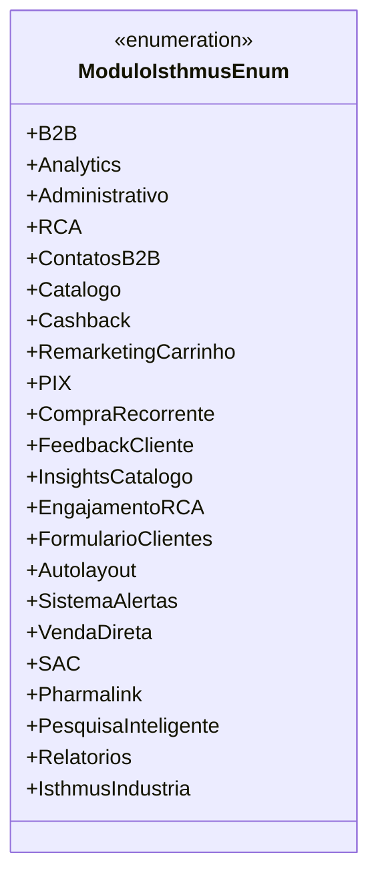

# ModuloIsthmusEnum
**Namespace**: IsthmusWinthor.Dominio.Enumeradores  
**Nome do Arquivo**: ModuloIsthmusEnum.cs  

O `ModuloIsthmusEnum` é um enumerador que representa os diferentes módulos do sistema Isthmus. Ele categoriza as funcionalidades e características do software, permitindo uma padronização e referência consistente ao longo da aplicação. 

## Tipos Auxiliares e Dependências
- **Enumeradores**:
  - [ModuloIsthmusEnum](ModuloIsthmusEnum.md) (O próprio tipo)

## Diagrama de Relacionamentos

---
Gerada em 29/12/2025 20:57:50
