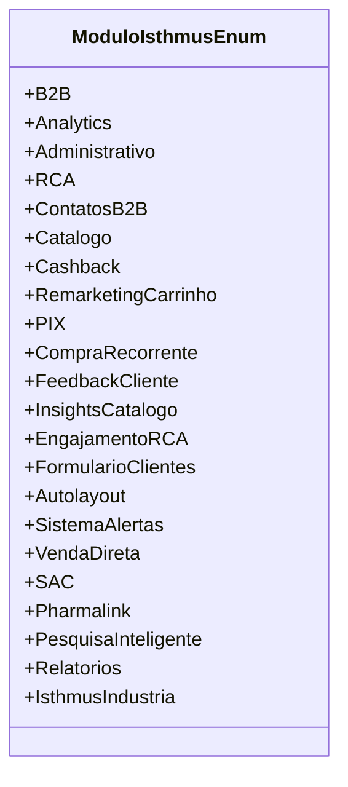

# ModuloIsthmusEnum
**Namespace**: IsthmusWinthor.Dominio.Enumeradores  
**Nome do Arquivo**: ModuloIsthmusEnum.cs

## Visão Geral e Responsabilidade
O `ModuloIsthmusEnum` é uma enumeração que define os módulos disponíveis na plataforma Isthmus. Cada valor no enum representa uma funcionalidade específica que pode ser utilizada no sistema, permitindo a categorização e a identificação clara de diferentes áreas de funcionalidade. Essa estrutura facilita a manutenção do código e a implementação de regras de negócio relacionadas a cada módulo.

## Tipos Auxiliares e Dependências
- Nenhum tipo auxiliar adicional ou dependência foi identificado. 

## Diagrama de Relacionamentos

