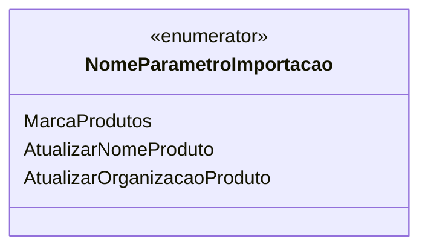

# NomeParametroImportacao
**Namespace**: IsthmusWinthor.Dominio.Enumeradores  
**Nome do Arquivo**: NomeParametroImportacao.cs  

## Visão Geral e Responsabilidade
A classe `NomeParametroImportacao` é um enumerador que define constantes relacionadas aos parâmetros utilizados durante o processo de importação de dados de produtos. Este tipo é fundamental para garantir que o sistema manipule adequadamente diferentes opções de configuração quando novas informações de produtos são importadas, estabelecendo, assim, a integridade e a clareza necessárias para a operação de importação.

## Tipos Auxiliares e Dependências
- **Enumeradores**:
  - [NomeParametroImportacao](NomeParametroImportacao.md) - Define os parâmetros que influenciam o comportamento durante a importação de produtos.

## Diagrama de Relacionamentos

---
Gerada em 29/12/2025 20:57:54
