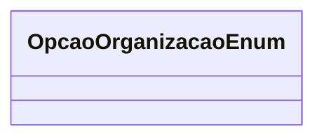

# OpcaoOrganizacaoEnum
**Namespace**: Isthmus.Dominio.Enumeradores  
**Nome do Arquivo**: OpcaoOrganizacaoEnum.cs  

Este enumerador define as opções de organização disponíveis no sistema, representando diferentes níveis e categorias de estrutura organizacional. Ele é utilizado para classificar e categorizar dados de forma consistente dentro da aplicação.  

## Tipos Auxiliares e Dependências
- Enumeradores:
  - [OpcaoOrganizacaoEnum](OpcaoOrganizacaoEnum.md) - Opções para organização estrutural.  

## Diagrama de Relacionamentos

---
Gerada em 29/12/2025 20:57:58
