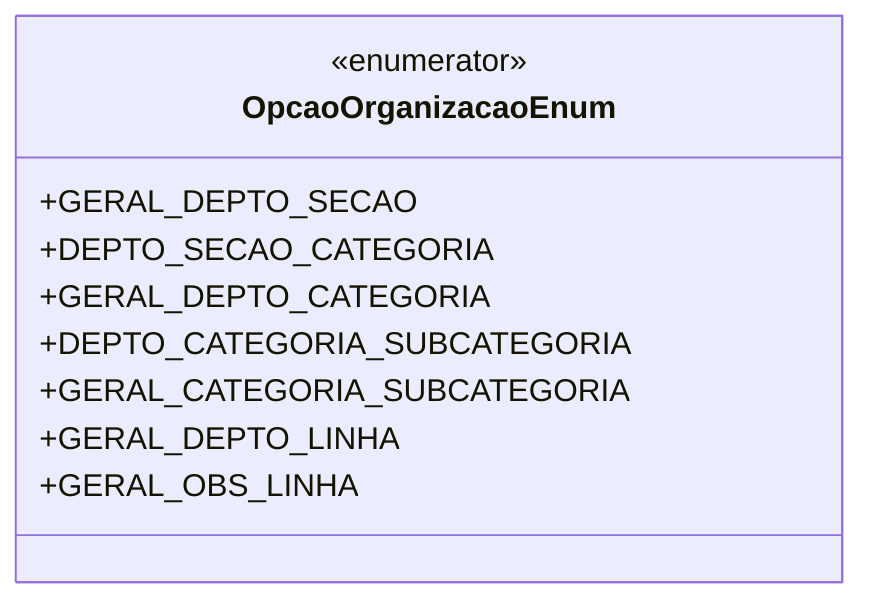

# OpcaoOrganizacaoEnum
**Namespace**: Isthmus.Dominio.Enumeradores  
**Nome do Arquivo**: OpcaoOrganizacaoEnum.cs  

## Visão Geral e Responsabilidade
O `OpcaoOrganizacaoEnum` representa um conjunto de opções de organização que é utilizado na configuração de hierarquias e categorias dentro de um sistema. Este enumerador é crucial para a definição de como as entidades organizacionais são agrupadas e estruturadas, permitindo que os desenvolvedores definam comportamentos e regras com base nas diferentes opções de organização disponíveis.

## Métodos de Negócio
- **Título**: N/A  
  **Objetivo**: N/A  
  **Comportamento**: Este é um enumerador e não contém métodos com lógica efetiva; os valores são utilizados como constantes de controle em diferentes partes do sistema.  
  **Retorno**: N/A

## Propriedades Calculadas e de Validação
N/A

## Navigations Property
N/A

## Tipos Auxiliares e Dependências
- `OpcaoOrganizacaoEnum` é um enumerador e não possui dependências adicionais.

## Diagrama de Relacionamentos

