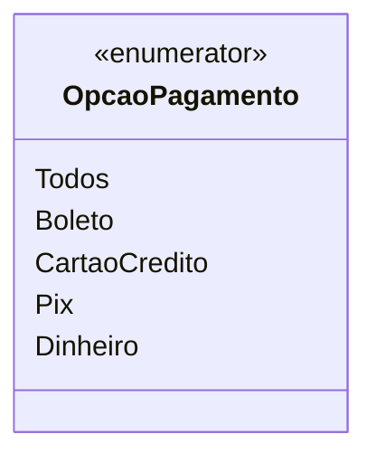

# OpcaoPagamento
**Namespace**: IsthmusWinthor.Dominio.Enumeradores  
**Nome do Arquivo**: OpcaoPagamento.cs  

O enumerador `OpcaoPagamento` define os modos de pagamento disponíveis em um sistema de transações financeiras, facilitando a escolha e o gerenciamento das diferentes opções de pagamento que um usuário pode selecionar.

## Métodos de Negócio
- **Título**: N/A  
  - **Objetivo**: Este enumerador não contém métodos de negócio, mas serve para categorizar as opções de pagamento disponíveis e garantir a integridade na escolha do modo de pagamento.
  - **Comportamento**: As opções disponíveis são definidas através de membros do enumerador, representando diferentes métodos de pagamento. O sistema pode utilizar esse enumerador para limitação e filtragem de opções de pagamento em formulários e processos de pagamento.
  - **Retorno**: A atribuição a uma variável deste tipo retorna um modo de pagamento que foi definido, assegurando que os valores utilizados são válidos e conhecidos pelo sistema.

## Propriedades Calculadas e de Validação
- Este enumerador não possui propriedades calculadas ou validações.

## Navigations Property
- Este enumerador não contém propriedades de navegação.

## Tipos Auxiliares e Dependências
- Nenhum tipo auxiliar ou dependência adicional foi identificado.

## Diagrama de Relacionamentos

Esta documentação visa fornecer uma compreensão clara da finalidade do `OpcaoPagamento`, assegurando que todos os envolvidos no desenvolvimento e manutenção do sistema estejam cientes de como e por que esse enumerador deve ser utilizado.
