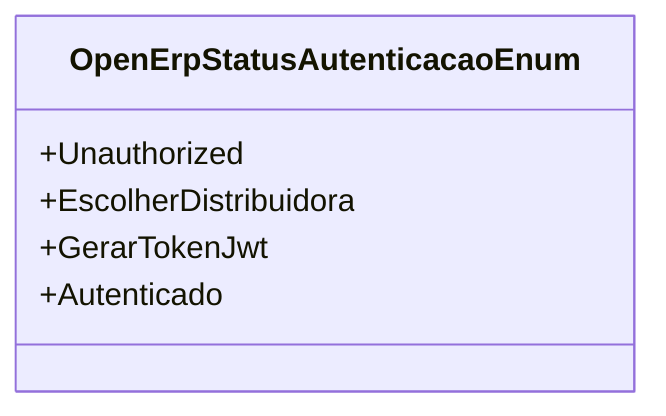

# OpenErpStatusAutenticacaoEnum
**Namespace**: IsthmusWinthor.Dominio.Enumeradores  
**Nome do Arquivo**: OpenErpStatusAutenticacaoEnum.cs  

Este enum é utilizado para representar os diferentes estados de autenticação em um processo relacionado ao Open ERP. Ele fornece uma maneira de identificar facilmente a situação atual do fluxo de autenticação, permitindo que o sistema atue de acordo com cada status definido.

## Tipos Auxiliares e Dependências
- **Enums**:
  - `[OpenErpStatusAutenticacaoEnum](OpenErpStatusAutenticacaoEnum.md)`

## Diagrama de Relacionamentos

