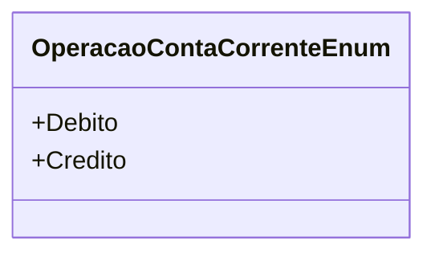

# OperacaoContaCorrenteEnum
**Namespace**: IsthmusWinthor.Dominio.Enumeradores  
**Nome do Arquivo**: OperacaoContaCorrenteEnum.cs  

O `OperacaoContaCorrenteEnum` é um enumerador que serve para classificar as operações financeiras realizadas em uma conta corrente, facilitando a distinção entre entradas e saídas de valores.

## Tipos Auxiliares e Dependências
- Enum: `[OperacaoContaCorrenteEnum](OperacaoContaCorrenteEnum.md)`

## Diagrama de Relacionamentos

