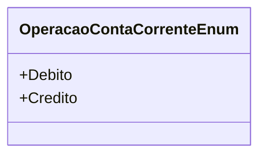

# OperacaoContaCorrenteEnum
- **Namespace**: IsthmusWinthor.Dominio.Enumeradores
- **Nome do Arquivo**: OperacaoContaCorrenteEnum.cs

### Descrição
O `OperacaoContaCorrenteEnum` é uma enumeração utilizada para categorizar as operações financeiras realizadas em uma conta corrente, apoiando a identificação clara de transações de débito e crédito.

### Tipos Auxiliares e Dependências
- Enum: [OperacaoContaCorrenteEnum](OperacaoContaCorrenteEnum.md)

### Diagrama de Relacionamentos

---
Gerada em 29/12/2025 20:58:07
