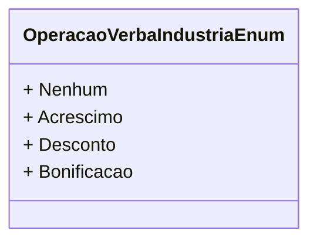

# OperacaoVerbaIndustriaEnum
**Namespace**: IsthmusWinthor.Dominio.Enumeradores  
**Nome do Arquivo**: OperacaoVerbaIndustriaEnum.cs

O `OperacaoVerbaIndustriaEnum` é um enumerador que define as operações relacionadas a verbas na indústria, permitindo um mapeamento claro das diferentes ações que podem ser aplicadas em processos financeiros e contábeis. Ele ajuda a categoria e descrever as operações de adição ou subtração de valores ao se lidar com verbas em um contexto empresarial.

## Tipos Auxiliares e Dependências
- Nenhum.

## Diagrama de Relacionamentos

