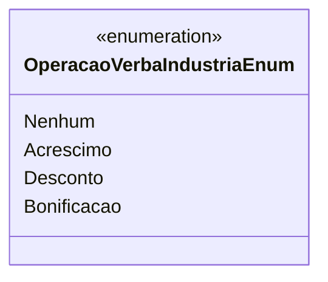

# OperacaoVerbaIndustriaEnum
**Namespace**: IsthmusWinthor.Dominio.Enumeradores  
**Nome do Arquivo**: OperacaoVerbaIndustriaEnum.cs  

## Visão Geral e Responsabilidade
O `OperacaoVerbaIndustriaEnum` é um enumerador que representa diferentes tipos de operações financeiras aplicáveis a verbas da indústria. Ele ajuda a categorizar as operações realizadas, permitindo um controle mais eficaz sobre as transações financeiras que envolvem acréscimos, descontos e bonificações. A presença deste enum garante que as operações sejam tratadas de maneira consistente e que o sistema consiga identificar rapidamente o tipo de operação que está sendo processada.

## Tipos Auxiliares e Dependências
- **Descrição das operações**:
  - `Nenhum`: Representa a ausência de operação aplicável.
  - `Acréscimo`: Indica uma operação que adiciona valor.
  - `Desconto`: Refere-se a uma operação que subtrai valor.
  - `Bonificacao`: Representa uma gratificação adicional.

Esses valores podem ser utilizados em diversas partes do sistema, servindo como referência para a aplicação de regras de negócio relacionadas às verbas industriais.

## Diagrama de Relacionamentos

---
Gerada em 29/12/2025 20:58:14
