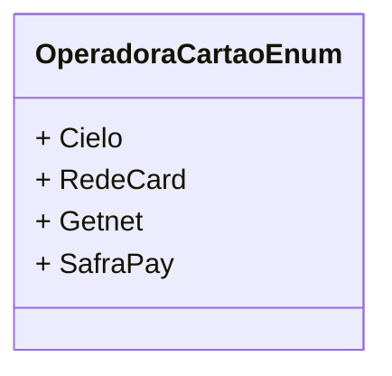

# OperadoraCartaoEnum
**Namespace**: IsthmusWinthor.Dominio.Enumeradores  
**Nome do Arquivo**: OperadoraCartaoEnum.cs  

### Visão Geral e Responsabilidade
O `OperadoraCartaoEnum` é um enumerador que define as diferentes operadoras de cartão de crédito disponíveis no sistema. Este componente é crucial para garantir a padronização e integridade dos dados relacionados a transações financeiras, assegurando que somente valores predefinidos sejam utilizados nas operações envolvendo pagamentos.

### Tipos Auxiliares e Dependências
- Enum: `[OperadoraCartaoEnum](OperadoraCartaoEnum.md)`

### Diagrama de Relacionamentos

