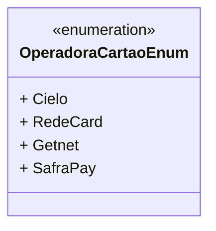

# OperadoraCartaoEnum
**Namespace**: IsthmusWinthor.Dominio.Enumeradores  
**Nome do Arquivo**: OperadoraCartaoEnum.cs  

Este é um enumerador que define as operadoras de cartão disponíveis no sistema de pagamento.

## Tipos Auxiliares e Dependências
- Enumeradores:
  - [OperadoraCartaoEnum](OperadoraCartaoEnum.md)

## Diagrama de Relacionamentos

---
Gerada em 29/12/2025 20:58:17
