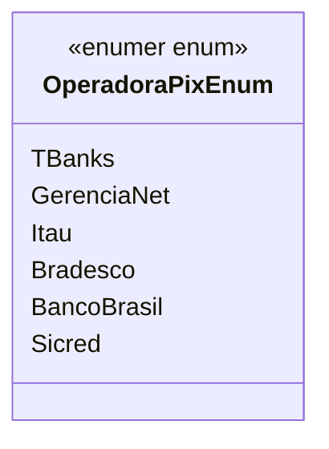

# OperadoraPixEnum
**Namespace**: IsthmusWinthor.Dominio.Enumeradores  
**Nome do Arquivo**: OperadoraPixEnum.cs  

O `OperadoraPixEnum` é uma enumeração que representa as diferentes operadoras financeiras que suportam o sistema de pagamento via Pix. Sua finalidade é garantir que apenas valores reconhecidos e válidos possam ser utilizados nas transações, assegurando a integridade dos dados.

## Métodos de Negócio
Este enumerador não possui métodos de negócio, uma vez que seu único propósito é a definição de constantes que identificam operadoras de pagamento.

## Propriedades Calculadas e de Validação
Este enumerador não possui propriedades calculadas ou de validação, já que se limita a definir um conjunto fixo de valores.

## Navigations Property
Este enumerador também não possui propriedades de navegação, pois é um tipo simples que não se relaciona diretamente com outras classes de domínio.

## Tipos Auxiliares e Dependências
- Nenhuma classe auxiliar ou estática é utilizada diretamente por este enumerador.

## Diagrama de Relacionamentos

