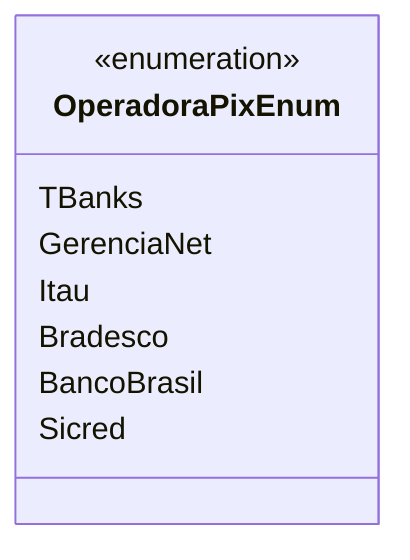

# OperadoraPixEnum
**Namespace**: IsthmusWinthor.Dominio.Enumeradores  
**Nome do Arquivo**: OperadoraPixEnum.cs  

`OperadoraPixEnum` é um enumerador que define as operadoras que suportam transações utilizando o sistema de pagamento Pix.

## Tipos Auxiliares e Dependências
- **Enumeradores**:
  - [OperadoraPixEnum](OperadoraPixEnum.md)
  
## Diagrama de Relacionamentos

Este enumerador representa uma lista de operadoras disponíveis no sistema, cada uma associada a um valor numérico único, que pode ser utilizado na configuração e no processamento de pagamentos via Pix.
---
Gerada em 29/12/2025 20:58:21
