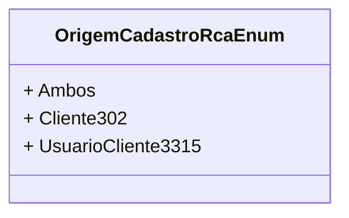

# OrigemCadastroRcaEnum
- **Namespace**: IsthmusWinthor.Dominio.Enumeradores
- **Nome do Arquivo**: OrigemCadastroRcaEnum.cs

Este enumerador é utilizado para classificar a origem do cadastro de um RCA (Representante Comercial Autônomo) no sistema. Ele oferece uma maneira de identificar a fonte do cadastro, que pode ser útil para relatórios e análise de dados comerciais.

## Tipos Auxiliares e Dependências
- Nenhum tipo auxiliar ou dependência adicional é utilizado por esta classe.

## Diagrama de Relacionamentos

---
Gerada em 29/12/2025 20:58:24
