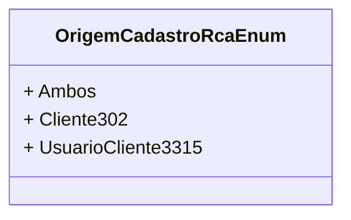

# OrigemCadastroRcaEnum
**Namespace**: IsthmusWinthor.Dominio.Enumeradores  
**Nome do Arquivo**: OrigemCadastroRcaEnum.cs  

Este é um enumerador que define as origens possíveis para o cadastro de um Representante Comercial Autônomo (RCA) no sistema.

## Tipos Auxiliares e Dependências
- **Enumeradores**: 
  - `[OrigemCadastroRcaEnum](OrigemCadastroRcaEnum.md)`

## Diagrama de Relacionamentos

