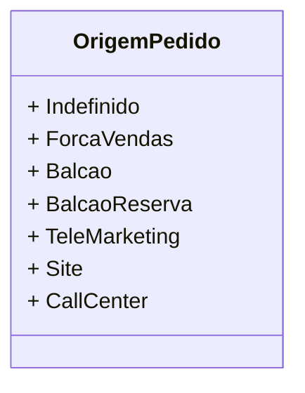

# OrigemPedido
**Namespace**: IsthmusWinthor.Dominio.Enumeradores  
**Nome do Arquivo**: OrigemPedido.cs  

O `OrigemPedido` é um enumerador que define as várias origens possíveis para um pedido dentro do sistema, permitindo categorizar de maneira rica e significativa as fontes de onde um pedido pode se originar. Essa classificação é crucial para análise de vendas e otimização de processos relacionados às preferências dos canais de venda dos clientes.

## Tipos Auxiliares e Dependências
- **Enumeradores**:
  - [OrigemPedido](OrigemPedido.md) - Enum que categoriza as diferentes origens de pedidos, como Força de Vendas, Balcão, Telemarketing, entre outros.

## Diagrama de Relacionamentos

---
Gerada em 29/12/2025 20:58:29
