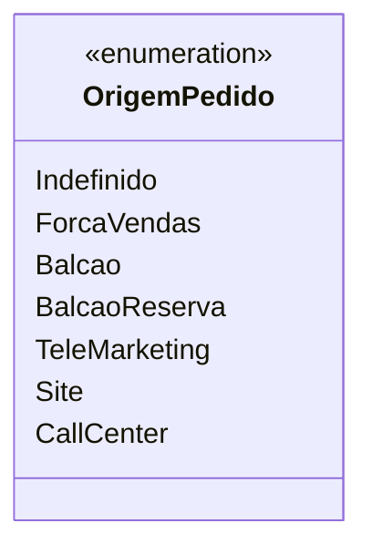

# OrigemPedido

**Namespace**: IsthmusWinthor.Dominio.Enumeradores  
**Nome do Arquivo**: OrigemPedido.cs

A enumeração `OrigemPedido` representa as diferentes origens de pedidos que podem ser registradas no sistema. Esse tipo é crucial para categorizar e identificar a procedência dos pedidos, garantindo uma organização e análise eficaz dos dados de vendas.

## Métodos de Negócio
A classe `OrigemPedido` não possui métodos de negócio, pois é uma simples enumeração. No entanto, sua presença permite garantir a validade dos dados referentes à origem dos pedidos.

## Propriedades Calculadas e de Validação
A classe não possui propriedades calculadas ou de validação, pois sua definição é de um enumerador, com um conjunto fixo de valores.

## Navigations Property
Esta classe não contém propriedades de navegação, visto que seu propósito é simplesmente ser um enumerador.

## Tipos Auxiliares e Dependências
Esta classe não possui dependências externas, além de ser definida dentro do namespace `IsthmusWinthor.Dominio.Enumeradores`.

## Diagrama de Relacionamentos

Essa enumeração, portanto, fornece uma estrutura sólida para a classificação dos pedidos no sistema corporativo, facilitando a gestão e análise de vendas com base na origem dos pedidos.
