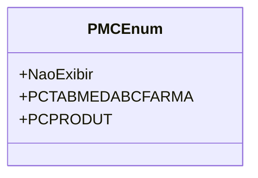

# PMCEnum
**Namespace**: IsthmusWinthor.Dominio.Enumeradores  
**Nome do Arquivo**: PMCEnum.cs  

O `PMCEnum` é um enumerador que define diferentes estados de exibição de opções relacionadas a produtos e medicamentos, com o objetivo de simplificar o manuseio de identificação e categorização dentro do sistema.

## Tipos Auxiliares e Dependências
- Enumeração: [PMCEnum](PMCEnum.md)  

## Diagrama de Relacionamentos

---
Gerada em 29/12/2025 20:59:25
