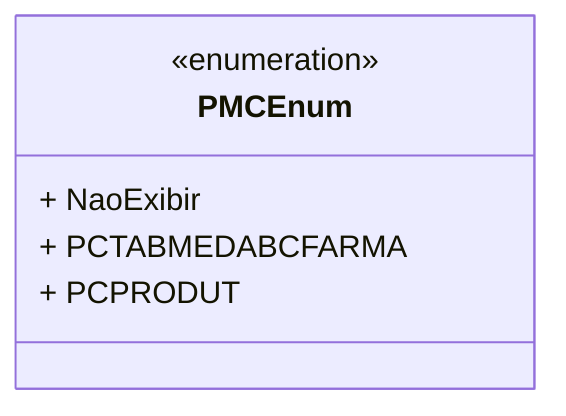

# PMCEnum
**Namespace**: IsthmusWinthor.Dominio.Enumeradores  
**Nome do Arquivo**: PMCEnum.cs  

O `PMCEnum` é uma enumeração que define constantes relacionadas à exibição do PMC (Preço Máximo ao Consumidor) em um sistema. Utilizando-se de descrições associativas, a enumeração possibilita a identificação clara das opções disponíveis e seus propósitos.

## Tipos Auxiliares e Dependências
- **Enums**:
  - `[PMCEnum](PMCEnum.md)`

## Diagrama de Relacionamentos

