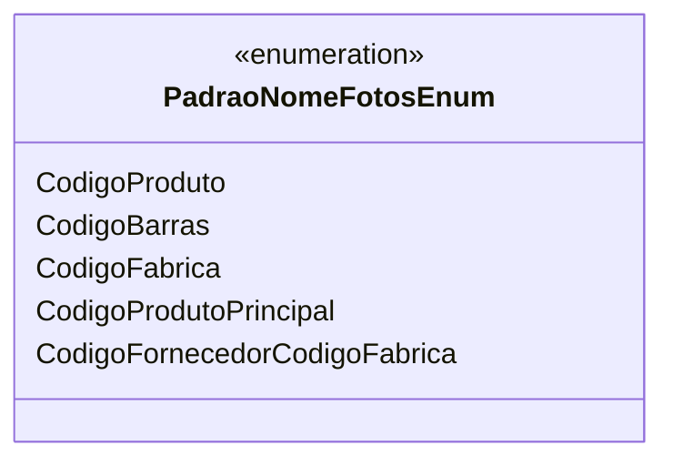

# PadraoNomeFotosEnum
**Namespace**: IsthmusWinthor.Dominio.Enumeradores  
**Nome do Arquivo**: PadraoNomeFotosEnum.cs  

Este enumerador é utilizado para definir padrões de nomenclatura para fotos dentro do sistema, oferecendo uma forma eficiente de referenciar diferentes formatos de nome que podem ser associados a produtos e fornecedores. 

## Tipos Auxiliares e Dependências
- Nenhuma classe complexa ou propriedade de navegação.
- Utilizado por classes que gerenciam a nomenclatura de fotos.

### Enumeradores
- [PadraoNomeFotosEnum](PadraoNomeFotosEnum.md)

## Diagrama de Relacionamentos

---
Gerada em 29/12/2025 20:58:32
