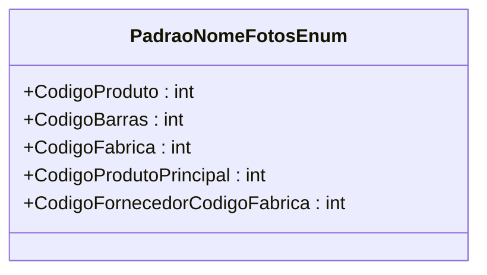

# PadraoNomeFotosEnum
**Namespace**: IsthmusWinthor.Dominio.Enumeradores  
**Nome do Arquivo**: PadraoNomeFotosEnum.cs  

O `PadraoNomeFotosEnum` define uma enumeração de valores que são utilizados para padronizar os nomes das fotos de produtos em um sistema corporativo. Cada constante representa uma forma distinta de identificação de um produto.

## Tipos Auxiliares e Dependências
- **Enumeradores**:
  - `[PadraoNomeFotosEnum](PadraoNomeFotosEnum.md)`: Define os padrões disponíveis para nomeação de fotos.

## Diagrama de Relacionamentos

