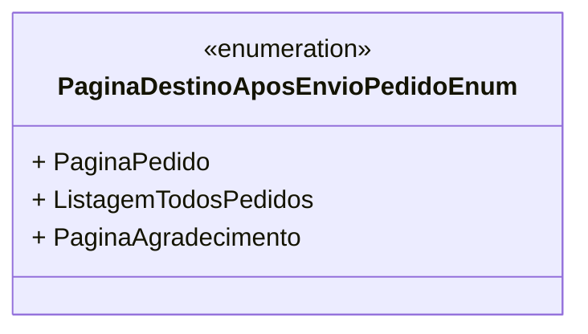

# PaginaDestinoAposEnvioPedidoEnum
**Namespace**: IsthmusWinthor.Dominio.Enumeradores  
**Nome do Arquivo**: PaginaDestinoAposEnvioPedidoEnum.cs  

Este é um enumerador que define as páginas de destino possíveis após o envio de um pedido, facilitando a navegação do usuário no sistema.

## Tipos Auxiliares e Dependências
- Nenhum tipo auxiliar ou dependência adicional.

## Diagrama de Relacionamentos

---
Gerada em 29/12/2025 20:58:36
