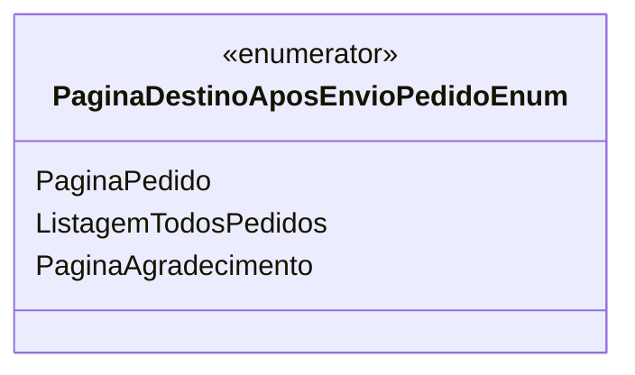

# PaginaDestinoAposEnvioPedidoEnum
- **Namespace**: IsthmusWinthor.Dominio.Enumeradores
- **Nome do Arquivo**: PaginaDestinoAposEnvioPedidoEnum.cs

Esta classe é um enumerador utilizada para transportar dados referentes às páginas de destino após o envio de um pedido no sistema.

## Tipos Auxiliares e Dependências
- `PaginaDestinoAposEnvioPedidoEnum` é um enumerador que define três opções de páginas para redirecionamento após o envio de um pedido.

## Diagrama de Relacionamentos

