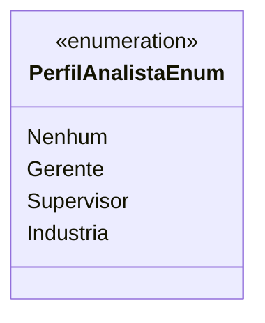

# PerfilAnalistaEnum
- **Namespace**: IsthmusWinthor.Dominio.Enumeradores
- **Nome do Arquivo**: PerfilAnalistaEnum.cs

## Visão Geral e Responsabilidade
O `PerfilAnalistaEnum` é uma enumeração que representa os diferentes perfis de analistas dentro do sistema. Essa enumeração ajuda a categorizar e controlar acessos, responsabilidades e funcionalidades disponíveis para cada tipo de perfil no domínio organizacional, garantindo que cada analista tenha as permissões e funções adequadas à sua posição.

## Tipos Auxiliares e Dependências
- Não há dependências ou classes auxiliares diretas associadas.

## Diagrama de Relacionamentos

