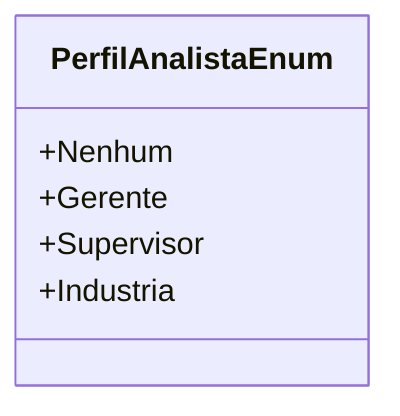

# PerfilAnalistaEnum
**Namespace**: IsthmusWinthor.Dominio.Enumeradores  
**Nome do Arquivo**: PerfilAnalistaEnum.cs  

Este enumerador define os diferentes perfis disponíveis para os analistas no sistema, servindo para transporte de dados e configuração de permissões de acesso.

---

## Tipos Auxiliares e Dependências
- O enumerador `PerfilAnalistaEnum` é utilizado para categorizar os perfis de analistas de acordo com suas responsabilidades e hierarquia dentro da organização.

### Valores do Enum
- **Nenhum**: Representa que nenhum perfil foi atribuído.
- **Gerente**: Perfil com responsabilidades de gerenciamento.
- **Supervisor**: Perfil responsável por supervisionar equipes.
- **Indústria**: Representa perfis relacionados à área industrial.

---

## Diagrama de Relacionamentos

---
Gerada em 29/12/2025 20:58:40
