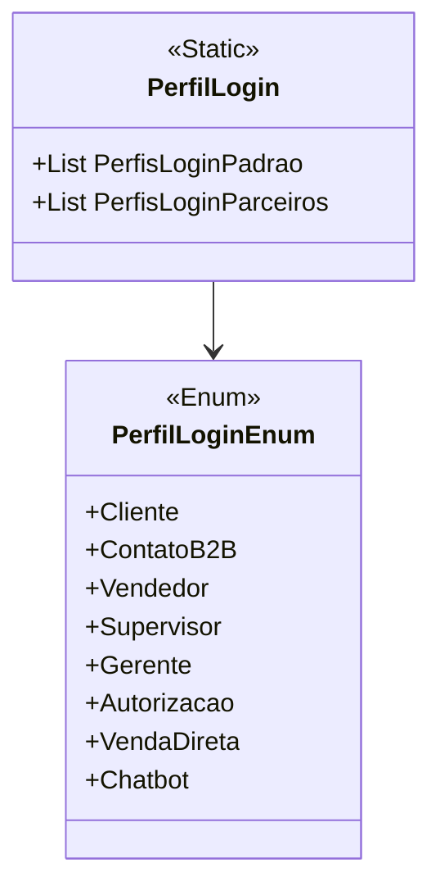

# PerfilLogin

**Namespace**: IsthmusWinthor.Dominio.Enumeradores  
**Nome do Arquivo**: PerfilLogin.cs

## Visão Geral e Responsabilidade
A classe `PerfilLogin` é responsável pela gestão dos perfis de login utilizados na plataforma, que incluem tanto logins padrão para usuários internos da base de clientes quanto logins solicitados por plataformas externas através de um processo de autorização. Esta gestão é crucial para garantir que diferentes tipos de usuários tenham acesso adequado às funcionalidades da aplicação, promovendo uma experiência consistente e segura.

## Métodos de Negócio

### Título: PerfisLoginPadrao (Visibilidade: Pública)
- **Objetivo**: Garantir que a lista de perfis de login padrão esteja sempre disponível e atualizada para usuários internos.
- **Comportamento**: Verifica se a lista `_perfisLoginPadrao` está inicializada. Se não estiver, inicializa essa lista com os perfis padrão (Cliente, ContatoB2B, Vendedor, Supervisor, Gerente e VendaDireta). 
- **Retorno**: Retorna uma lista dos perfis de login padrão representados pelo enumerador `PerfilLoginEnum`.

### Título: PerfisLoginParceiros (Visibilidade: Pública)
- **Objetivo**: Fornecer acesso à lista de perfis de login parceiros que requerem autorização externa.
- **Comportamento**: Realiza uma verificação para garantir que a lista `_perfisLoginParceiros` esteja inicializada. Se não estiver, inicializa-a com os perfis de login que requerem autorização (Autorizacao e Chatbot). 
- **Retorno**: Retorna uma lista dos perfis de login associados a plataformas externas.

## Propriedades Calculadas e de Validação
Não existem propriedades calculadas ou de validação que implementem lógica adicional.

## Navigations Property
Não há propriedades que sejam classes complexas do domínio nesta classe.

## Tipos Auxiliares e Dependências
- **Enumeradores**:
  - [PerfilLoginEnum](PerfilLoginEnum.md): Utilizado para definir os diferentes tipos de perfis de login.

## Diagrama de Relacionamentos

---
Gerada em 29/12/2025 20:58:53
