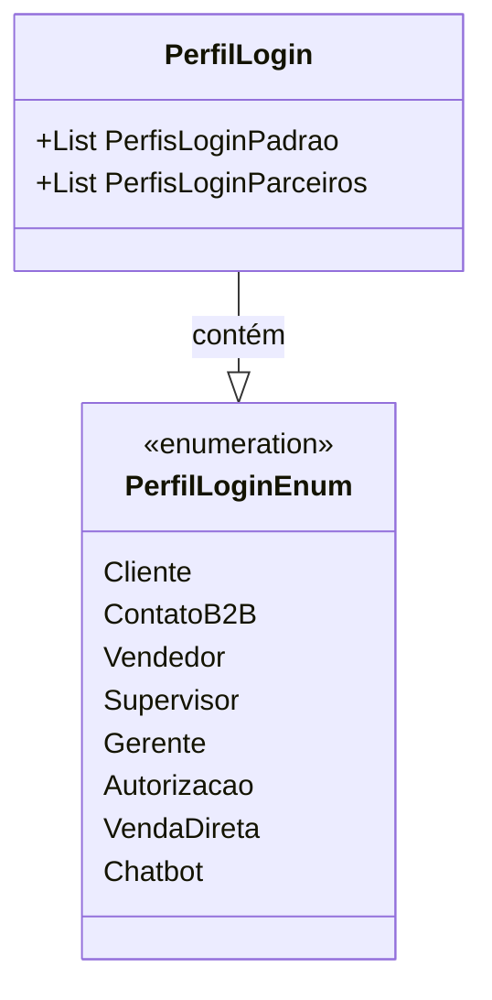

# PerfilLogin

**Namespace**: IsthmusWinthor.Dominio.Enumeradores  
**Nome do Arquivo**: PerfilLogin.cs

## Visão Geral e Responsabilidade
A classe `PerfilLogin` é responsável por gerenciar os perfis de login utilizados na plataforma, categorizando-os em dois grupos principais: perfis padrão e perfis de parceiros. Esta estrutura é fundamental para o controle de acesso e as permissões dentro do sistema, definindo quais funcionalidades estão disponíveis para cada tipo de usuário em diferentes contextos.

## Métodos de Negócio

### Título: PerfisLoginPadrao (Público)
- **Objetivo**: Garante que os perfis de login padrão que podem ser utilizados na plataforma sejam apresentados de forma consistente.
- **Comportamento**: 
  1. Verifica se a lista `_perfisLoginPadrao` já foi inicializada.
  2. Se não, inicializa a lista com os perfis de login padrão.
  3. Retorna a lista de perfis de login padrão.
- **Retorno**: Uma lista de `PerfilLoginEnum` representando os perfis de login padrão (Cliente, ContatoB2B, Vendedor, Supervisor, Gerente, VendaDireta).

### Título: PerfisLoginParceiros (Público)
- **Objetivo**: Garante que os perfis de login solicitados por plataformas externas, que requerem autorização, sejam apresentados de forma consistente.
- **Comportamento**: 
  1. Verifica se a lista `_perfisLoginParceiros` já foi inicializada.
  2. Se não, inicializa a lista com os perfis de login de parceiros.
  3. Retorna a lista de perfis de login de parceiros.
- **Retorno**: Uma lista de `PerfilLoginEnum` representando os perfis de login de parceiros (Autorizacao, Chatbot).

## Propriedades Calculadas e de Validação
- `PerfisLoginPadrao`: Garante que apenas perfis de login padrão válidos e necessários para a operação do sistema sejam disponibilizados.
- `PerfisLoginParceiros`: Garante que apenas perfis de login de parceiros válidos sejam disponibilizados conforme especificado.

## Navigations Property
Não há propriedades de navegação complexas para esta classe.

## Tipos Auxiliares e Dependências
- Enumerador: 
  - `[PerfilLoginEnum](PerfilLoginEnum.md)`

## Diagrama de Relacionamentos

