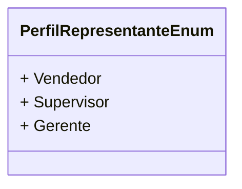

# PerfilRepresentanteEnum
- **Namespace**: IsthmusWinthor.Dominio.Enumeradores
- **Nome do Arquivo**: PerfilRepresentanteEnum.cs

O `PerfilRepresentanteEnum` é um enumerador que define os diferentes perfis que um representante pode ter dentro do sistema.

## Tipos Auxiliares e Dependências
- Nenhuma classe ou estrutura complexa é utilizada por esta enumeração.

### Enumeradores
- `PerfilRepresentanteEnum`:  
  Enum contendo os perfis disponíveis para os representantes, cada um identificando um nível de responsabilidade e cargo dentro da estrutura de vendas:
  - `Vendedor`: Representante que lida diretamente com vendas.
  - `Supervisor`: Responsável por supervisionar as atividades dos vendedores.
  - `Gerente`: Encarregado de gerenciar toda a equipe de vendas e estratégias.

## Diagrama de Relacionamentos

