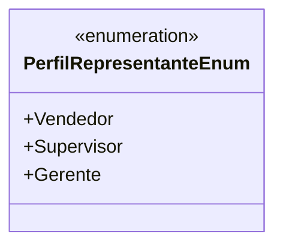

# PerfilRepresentanteEnum
**Namespace**: IsthmusWinthor.Dominio.Enumeradores  
**Nome do Arquivo**: PerfilRepresentanteEnum.cs  

Este enum define os diferentes perfis de representantes de vendas dentro do sistema, permitindo a categorização e controle das permissões e responsabilidades atribuídas a cada perfil.

## Tipos Auxiliares e Dependências
- **Enumeradores**:
  - [PerfilRepresentanteEnum](PerfilRepresentanteEnum.md)

## Diagrama de Relacionamentos

---
Gerada em 29/12/2025 20:58:55
