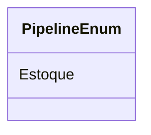

# PipelineEnum
**Namespace**: IsthmusWinthor.Dominio.Enumeradores  
**Nome do Arquivo**: PipelineEnum.cs  

## Visão Geral e Responsabilidade
O `PipelineEnum` é uma enumeração que define os estados do pipeline de operação, neste caso, representando o estado de "Estoque" com o valor associado de 5. Este enum tem a responsabilidade de padronizar a representação dos estados do pipeline dentro do sistema, permitindo que outras partes do código se refiram a esses estados de maneira consistente, o que é crucial para manter a integridade e a legibilidade da lógica de negocio relacionada a fluxos de operação.

## Métodos de Negócio
- **Título**: (Nenhum método com lógica complexa, apenas enumeração)  
- **Objetivo**: Define de forma padronizada os diferentes estados do pipeline, facilitando a sua utilização em verificações de lógica e na manipulação de fluxos de operação.  
- **Comportamento**: Esta enumeração é uma simples definição de valores associativos; não existem passos de lógica, uma vez que não há métodos ou comportamentos definidos que atuem sobre esses valores.
- **Retorno**: Não se aplica, pois não há retorno de métodos associados.

## Propriedades Calculadas e de Validação
- Nenhuma propriedade com lógica de cálculo ou validação.

## Navigation Property
- Nenhuma propriedade que seja uma classe complexa do domínio.

## Tipos Auxiliares e Dependências
- Nenhum enumerador ou classe auxiliar além de si mesmo.

## Diagrama de Relacionamentos

---
Gerada em 29/12/2025 20:59:04
