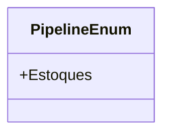

# PipelineEnum
**Namespace**: IsthmusWinthor.Dominio.Enumeradores  
**Nome do Arquivo**: PipelineEnum.cs  

Este enumerador é utilizado para categorizar os diferentes estados em que recursos podem se encontrar dentro de um sistema de gerenciamento de pipeline.

## Tipos Auxiliares e Dependências
- **Enumeradores**:
  - `PipelineEnum`: Enum utilizado para definir estados específicos de um pipeline, permitindo uma gestão mais clara e organizada dos processos dentro do sistema.

## Diagrama de Relacionamentos

