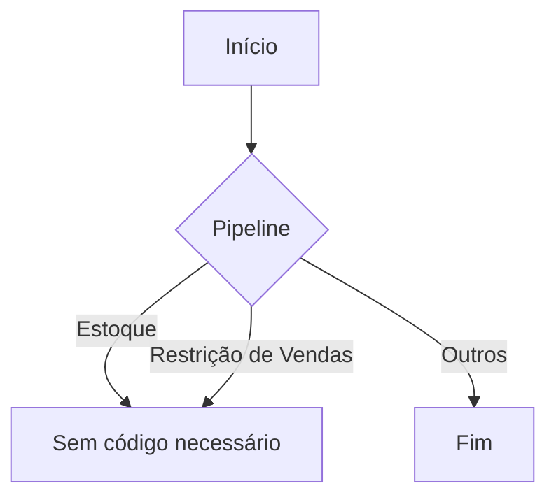
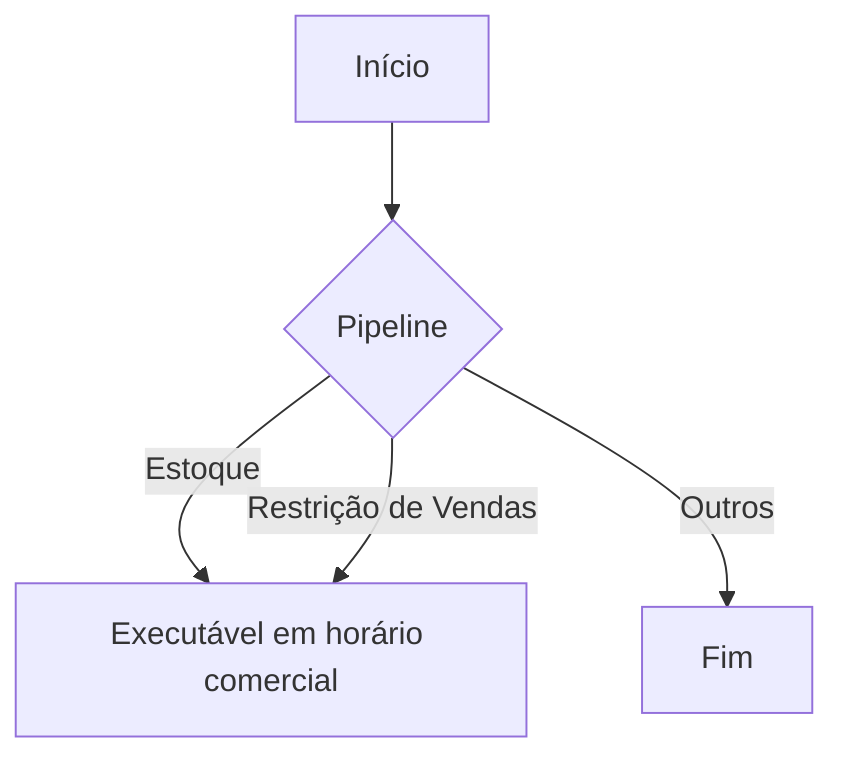
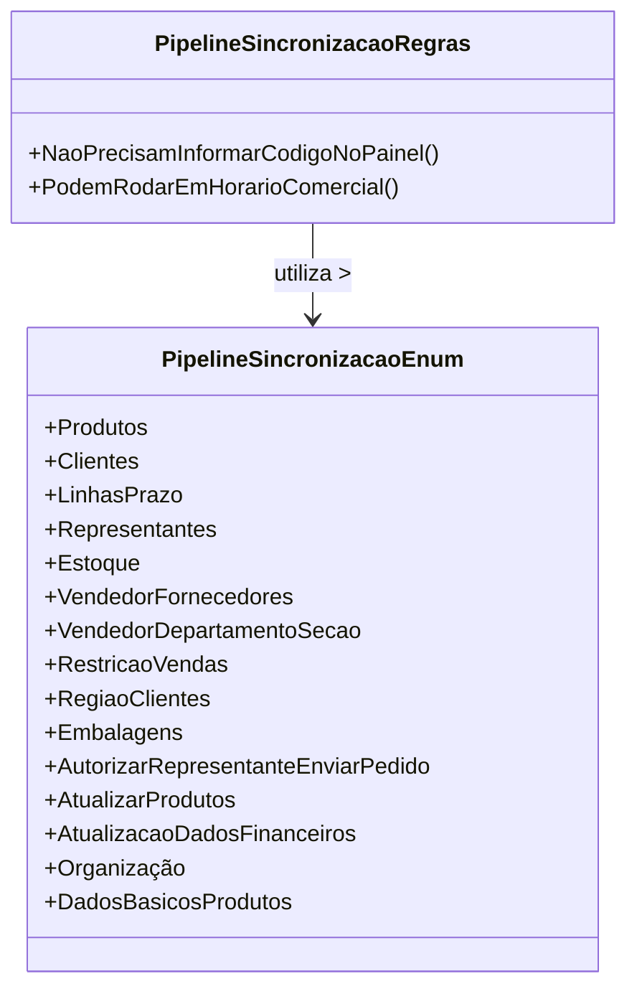

# PipelineSincronizacaoRegras

**Namespace**: IsthmusWinthor.Dominio.Enumeradores  
**Nome do Arquivo**: PipelineSincronizacaoRegras.cs

## Visão Geral e Responsabilidade
A classe `PipelineSincronizacaoRegras` é responsável por definir e fornecer regras de sincronização de dados dentro do sistema, mais especificamente em relação à execução de processos que não requerem a informação de código em um painel e que podem rodar em horário comercial. Esta classe ajuda a manter a integridade e a eficiência dos fluxos de dados, garantindo que os pipelines adequados sejam utilizados em circunstâncias apropriadas.

## Métodos de Negócio

### 1. Nome e Visibilidade: `NaoPrecisamInformarCodigoNoPainel` (public static)
- **Objetivo**: Retornar uma lista de pipelines que não precisam informar código no painel.
- **Comportamento**: 
  1. Inicializa uma lista de pipelines chamando o método privado `EmComum_NaoPrecisamInformarCodigoNoPainel_PodemRodarEmHorarioComercial`.
  2. Permite a adição de novas entradas que se encaixem na regra, através de comentários indicativos, que o programador pode descomentar e adaptar.
  3. Retorna a lista gerada.
- **Retorno**: Uma coleção de `PipelineSincronizacaoEnum` que representa os pipelines que podem ser executados sem necessidade de informar um código no painel.

### 2. Nome e Visibilidade: `PodemRodarEmHorarioComercial` (public static)
- **Objetivo**: Retornar uma lista de pipelines que podem ser executados em horário comercial.
- **Comportamento**:
  1. Inicializa uma lista de pipelines também usando `EmComum_NaoPrecisamInformarCodigoNoPainel_PodemRodarEmHorarioComercial`.
  2. Similar ao método anterior, possui a estrutura para adicionar futuras definições que possam se aplicar a essa regra.
  3. Retorna a lista gerada.
- **Retorno**: Uma coleção de `PipelineSincronizacaoEnum` que representa os pipelines que podem ser executados durante o horário comercial.

### Diagrama de Fluxo para `NaoPrecisamInformarCodigoNoPainel`

### Diagrama de Fluxo para `PodemRodarEmHorarioComercial`

## Propriedades Calculadas e de Validação
Não há propriedades calculadas ou de validação na classe `PipelineSincronizacaoRegras`, pois a lógica reside unicamente nos métodos.

## Navigation Property
- Não existem propriedades de navegação na classe.

## Tipos Auxiliares e Dependências
- **Enumeradores**: 
  - `[PipelineSincronizacaoEnum](PipelineSincronizacaoEnum.md)`

## Diagrama de Relacionamentos

