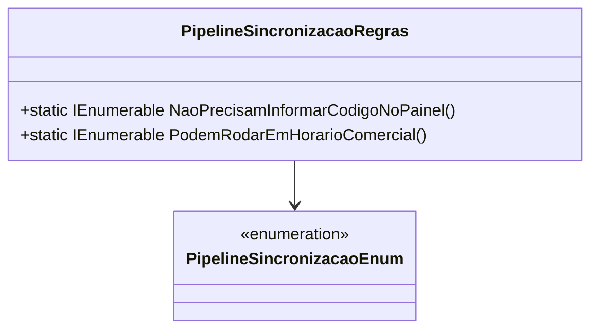

# PipelineSincronizacaoRegras

**Namespace**: IsthmusWinthor.Dominio.Enumeradores  
**Nome do Arquivo**: PipelineSincronizacaoRegras.cs

## Visão Geral e Responsabilidade
A classe `PipelineSincronizacaoRegras` é responsável por encapsular e centralizar a lógica de negócio relacionada às regras de sincronização de pipelines da aplicação. Ela auxilia na identificação de quais pipelines não precisam informar um código no painel e quais podem ser executados durante o horário comercial, ajudando a manter a integridade e a eficiência no processo de sincronização de dados.

## Métodos de Negócio

### Método: `NaoPrecisamInformarCodigoNoPainel()` - `public static`
- **Objetivo**: Este método garante que sejam identificados os pipelines que não exigem a indicação de um código específico ao serem executados no painel, facilitando a operação para os usuários que interagem com esses processos.
- **Comportamento**:
  1. Inicia uma lista de pipelines a partir do método auxiliar `EmComum_NaoPrecisamInformarCodigoNoPainel_PodemRodarEmHorarioComercial()`.
  2. Poderá adicionar pipelines específicos que atendem a esta regra, caso necessário.
  3. Retorna a lista de pipelines que não necessitam informar um código.
- **Retorno**: Retorna uma coleção de `PipelineSincronizacaoEnum` representando os pipelines que não precisam de um código no painel.

### Método: `PodemRodarEmHorarioComercial()` - `public static`
- **Objetivo**: Este método garante que sejam identificados quais pipelines estão autorizados a rodar durante o horário comercial, otimizando a operação e gerenciando melhor os recursos disponíveis.
- **Comportamento**:
  1. Inicia uma lista de pipelines a partir do método auxiliar `EmComum_NaoPrecisamInformarCodigoNoPainel_PodemRodarEmHorarioComercial()`.
  2. Poderá incluir pipelines adicionais que possam rodar nesse horário, caso necessário.
  3. Retorna a lista de pipelines liberados para a execução no horário comercial.
- **Retorno**: Retorna uma coleção de `PipelineSincronizacaoEnum` que especifica quais pipelines estão autorizados a rodar durante horário comercial.

## Propriedades Calculadas e de Validação
- Não há propriedades que possuam lógica no `get` ou validações no `set` nesta classe.

## Navigations Property
- Não existem propriedades que sejam classes complexas do domínio nesta classe.

## Tipos Auxiliares e Dependências
- Enum: [PipelineSincronizacaoEnum](PipelineSincronizacaoEnum.md)

## Diagrama de Relacionamentos

---
Gerada em 29/12/2025 20:59:18
