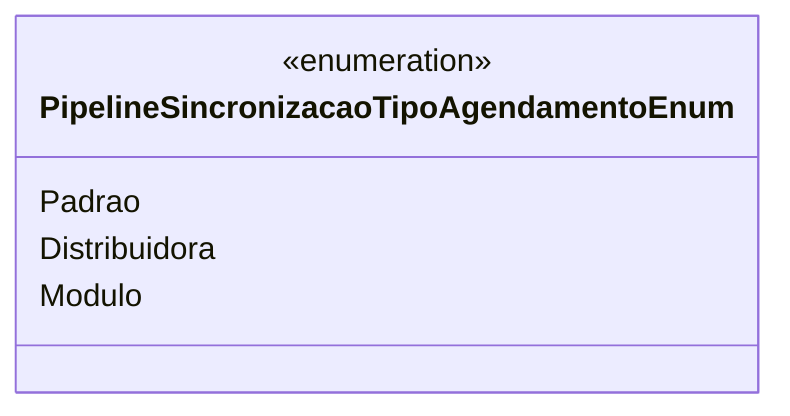

# PipelineSincronizacaoTipoAgendamentoEnum
- **Namespace**: IsthmusWinthor.Dominio.Enumeradores
- **Nome do Arquivo**: PipelineSincronizacaoTipoAgendamentoEnum.cs

Este enumerador define os diferentes tipos de agendamento utilizados no contexto de sincronização de pipelines. 

## Tipos Auxiliares e Dependências
- Enumeradores:
  - [PipelineSincronizacaoTipoAgendamentoEnum](PipelineSincronizacaoTipoAgendamentoEnum.md) 

## Diagrama de Relacionamentos

---
Gerada em 29/12/2025 20:59:22
