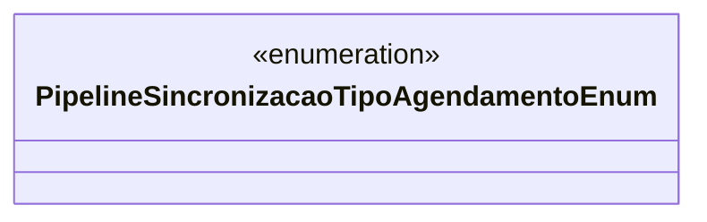

# PipelineSincronizacaoTipoAgendamentoEnum
**Namespace**: IsthmusWinthor.Dominio.Enumeradores  
**Nome do Arquivo**: PipelineSincronizacaoTipoAgendamentoEnum.cs  

Este enumerador define os tipos de agendamento que podem ser utilizados no contexto da sincronização de pipelines, proporcionando flexibilidade na escolha do tipo de agendamento a ser aplicado em operações relacionadas.

## Tipos Auxiliares e Dependências
- `PipelineSincronizacaoTipoAgendamentoEnum`: Enum que define os tipos de agendamento disponíveis.
  
### Enum
- `Padrao`: Tipo de agendamento padrão utilizado para operações gerais.
- `Distribuidora`: Tipo de agendamento específico para operações associadas a distribuidoras.
- `Modulo`: Tipo de agendamento relacionado a módulos específicos dentro do sistema.

## Diagrama de Relacionamentos

