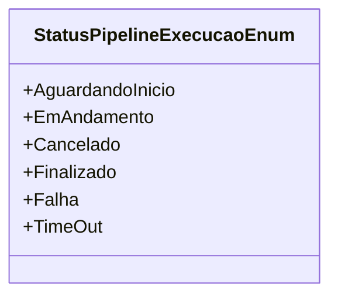

# StatusPipelineExecucaoEnum
**Namespace**: IsthmusWinthor.Dominio.Enumeradores.Pipelines  
**Nome do Arquivo**: StatusPipelineExecucaoEnum.cs  

O `StatusPipelineExecucaoEnum` é um enumerador que define os status possíveis para a execução de um pipeline em um sistema, fornecendo uma forma de padronizar e controlar as diferentes etapas de processamento de uma tarefa.

## Tipos Auxiliares e Dependências
- Enumeradores:
  - `[StatusPipelineExecucaoEnum](StatusPipelineExecucaoEnum.md)`

## Diagrama de Relacionamentos

