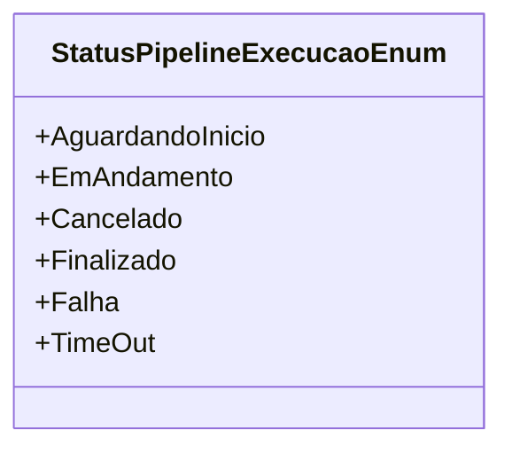

# StatusPipelineExecucaoEnum
**Namespace**: IsthmusWinthor.Dominio.Enumeradores.Pipelines  
**Nome do Arquivo**: StatusPipelineExecucaoEnum.cs  

O `StatusPipelineExecucaoEnum` é uma enumeração que representa os diferentes estados de execução de um pipeline dentro de um sistema. Ele é fundamental para a gestão do fluxo de processos, possibilitando a monitorização e controle das diversas fases que um pipeline pode atravessar.

## Tipos Auxiliares e Dependências
- **Enumeradores**:
  - [StatusPipelineExecucaoEnum](StatusPipelineExecucaoEnum.md) 

## Diagrama de Relacionamentos

Essa enumeração contribui para a integridade de dados do sistema, fornecendo uma maneira robusta de referenciar e gerenciar o estado de execução dos pipelines, prevenindo erros e inconsistências ao permitir que o sistema e os desenvolvedores utilizem nomes significativos em vez de valores numéricos.
---
Gerada em 29/12/2025 21:08:17
