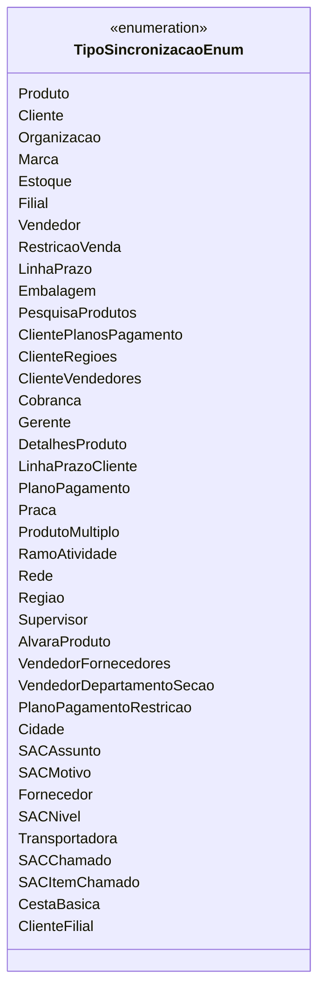

# TipoSincronizacaoEnum
**Namespace**: IsthmusWinthor.Dominio.Enumeradores.Pipelines  
**Nome do Arquivo**: TipoSincronizacaoEnum.cs  

O `TipoSincronizacaoEnum` é um enumerador utilizado para categorizar diferentes tipos de sincronia dentro de um sistema. Ele define as constantes que podem ser usadas em operações relacionadas ao gerenciamento de dados em diversas entidades, como produtos, clientes e organização. Este enum é vital para garantir que o sistema opere com a integridade e padronização necessária em processos de sincronização.

## Tipos Auxiliares e Dependências
- **Enumeradores**:
  - [TipoSincronizacaoEnum](TipoSincronizacaoEnum.md)

## Diagrama de Relacionamentos

---
Gerada em 29/12/2025 21:08:25
