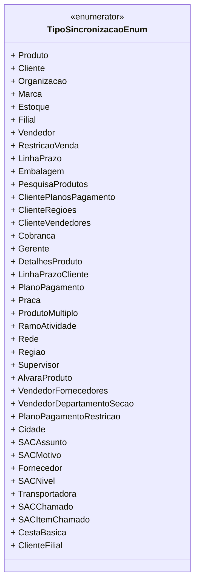

# TipoSincronizacaoEnum
**Namespace**: IsthmusWinthor.Dominio.Enumeradores.Pipelines  
**Nome do Arquivo**: TipoSincronizacaoEnum.cs  

Este é um enumerador que define os tipos de sincronização utilizados no sistema para gerenciar conceitos diversos relacionados a entidades de negócio.

## Tipos Auxiliares e Dependências
- **Enumeradores**: 
  - [TipoSincronizacaoEnum](TipoSincronizacaoEnum.md) - Representa os diferentes tipos de sincronização que podem ser realizadas no sistema, abrangendo entidades como Produto, Cliente e Organização.

## Diagrama de Relacionamentos

