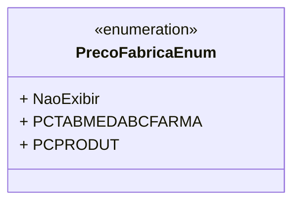

# PrecoFabricaEnum
**Namespace**: IsthmusWinthor.Dominio.Enumeradores  
**Nome do Arquivo**: PrecoFabricaEnum.cs  

## Visão Geral e Responsabilidade
O `PrecoFabricaEnum` é uma enumeração que define diferentes opções para a exibição de preços de fábrica em um sistema. A finalidade principal deste enumerador é fornecer uma maneira organizada de representar como as informações de preço devem ser tratadas, permitindo que outras partes do sistema se referenciem a essas opções de forma consistente. Isso é fundamental para a lógica de apresentação e operação com dados financeiros e comerciais.

## Métodos de Negócio
- **Título**: N/A  
- **Objetivo**: Este enumerador não possui métodos complexos com lógica de negócio, mas garante que as opções de exibição de preço sejam gerenciadas de forma padronizada no sistema.

## Propriedades Calculadas e de Validação
- Não há propriedades calculadas ou de validação nesta enumeração, uma vez que ela serve apenas como um conjunto de constantes que representam estados ou opções.

## Navigations Property
- Não há propriedades de navegação associadas a esta enumeração.

## Tipos Auxiliares e Dependências
- Nenhum tipo auxiliar ou dependência complexa é utilizado nesta enumeração, mas o sistema pode utilizar descrições através do atributo `Description`.

## Diagrama de Relacionamentos

