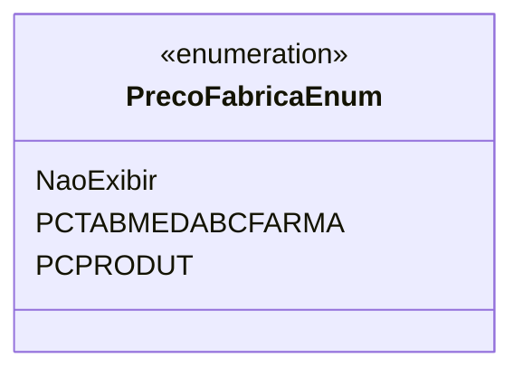

# PrecoFabricaEnum
**Namespace**: IsthmusWinthor.Dominio.Enumeradores  
**Nome do Arquivo**: PrecoFabricaEnum.cs  

Este enumerador define os valores possíveis para o preço de fábrica, que é utilizado nas operações de precificação de produtos, permitindo uma identificação clara das diferentes opções disponíveis.

## Tipos Auxiliares e Dependências
- Nenhum tipo auxiliar ou dependência complexa específica foi identificada além de suas definições.

## Diagrama de Relacionamentos

---
Gerada em 29/12/2025 20:59:28
