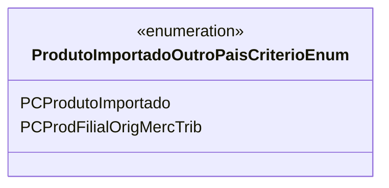

# ProdutoImportadoOutroPaisCriterioEnum
**Namespace**: IsthmusWinthor.Dominio.Enumeradores  
**Nome do Arquivo**: ProdutoImportadoOutroPaisCriterioEnum.cs

O `ProdutoImportadoOutroPaisCriterioEnum` é um enumerador que define os critérios de classificação para produtos importados de outros países. Ele é utilizado em lógicas de negócio onde a identificação do tipo de produto é crucial para aplicações, regras fiscais e operações comerciais.

## Tipos Auxiliares e Dependências
- **Enumeradores**:
  - `[ProdutoImportadoOutroPaisCriterioEnum](ProdutoImportadoOutroPaisCriterioEnum.md)`

## Diagrama de Relacionamentos

