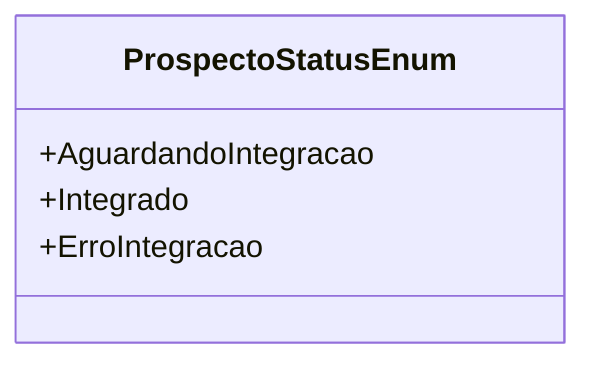

# ProspectoStatusEnum
**Namespace**: IsthmusWinthor.Dominio.Enumeradores  
**Nome do Arquivo**: ProspectoStatusEnum.cs  

Este enumerador define os diferentes estados que um prospecto pode ter durante seu ciclo de integração, permitindo a categorização do estado do prospecto para facilitar o gerenciamento e a tomada de decisões dentro do sistema.

## Tipos Auxiliares e Dependências
- Este enumerador é utilizado por outras classes e lógicas de negócio para controlar o status dos prospectos em todo o sistema.

---
Gerada em 29/12/2025 20:59:34
