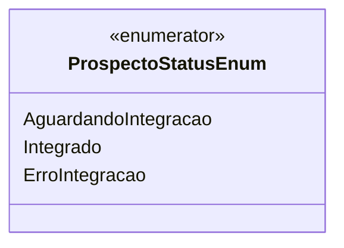

# ProspectoStatusEnum
**Namespace**: IsthmusWinthor.Dominio.Enumeradores  
**Nome do Arquivo**: ProspectoStatusEnum.cs  

ProspectoStatusEnum é um enumerador que define os possíveis estados de um prospecto na aplicação, refletindo o status atual do processo de integração do prospecto.

## Tipos Auxiliares e Dependências
- Não há classes complexas do domínio na classe atual. 

### Enumeradores
- `[ProspectoStatusEnum](ProspectoStatusEnum.md)`: Este enumerador categoriza o status de um prospecto em três estados possíveis: "Aguardando integração", "Integrado", e "Erro de integração".

## Diagrama de Relacionamentos

