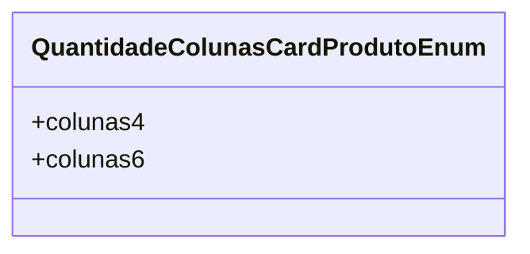

# QuantidadeColunasCardProdutoEnum
**Namespace**: IsthmusWinthor.Dominio.Enumeradores  
**Nome do Arquivo**: QuantidadeColunasCardProdutoEnum.cs  

Este enumerador define as quantidades possíveis de colunas que um cartão de produto pode ter na interface de um sistema, servindo como uma referência centralizada para a lógica de apresentação dos dados.

## Tipos Auxiliares e Dependências
- Nenhum.

## Diagrama de Relacionamentos

---
Gerada em 29/12/2025 20:59:37
