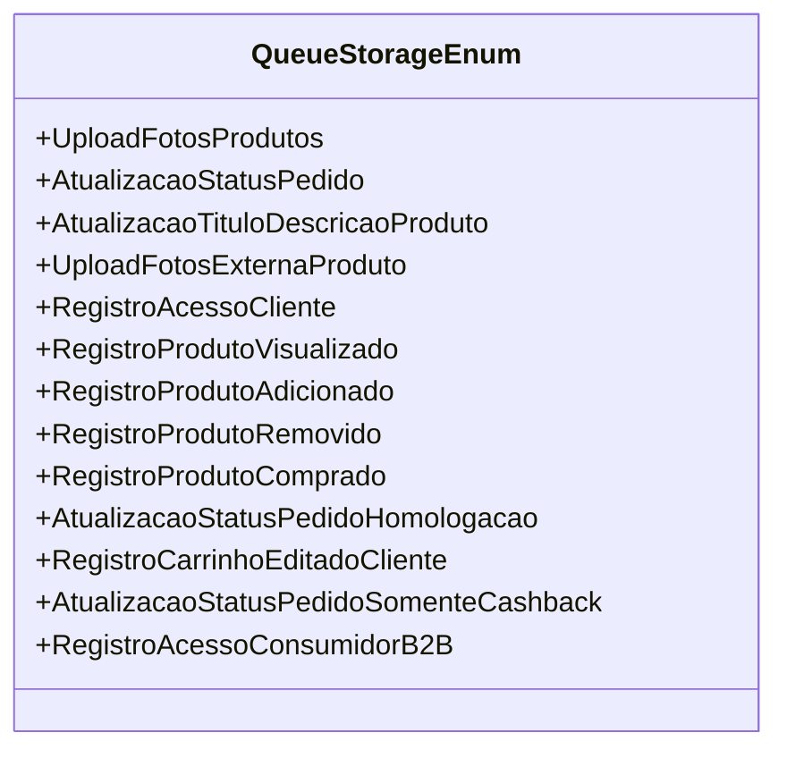

# QueueStorageEnum
**Namespace**: IsthmusWinthor.Dominio.Enumeradores  
**Nome do Arquivo**: QueueStorageEnum.cs  

Este enumerador é utilizado para categorizar diferentes tipos de eventos que ocorrem em um sistema, relacionados principalmente a filas de armazenamento. Cada valor representa uma ação específica que o sistema pode registrar ou monitorar.

## Tipos Auxiliares e Dependências
- Enumeradores:
  - [QueueStorageEnum](QueueStorageEnum.md) 

## Diagrama de Relacionamentos

---
Gerada em 29/12/2025 20:59:42
