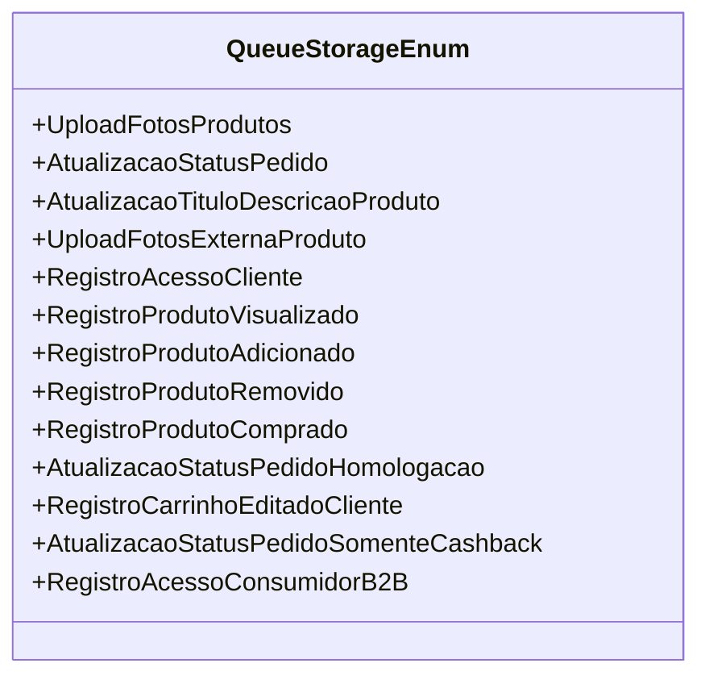

# QueueStorageEnum
**Namespace**: IsthmusWinthor.Dominio.Enumeradores  
**Nome do Arquivo**: QueueStorageEnum.cs  

O `QueueStorageEnum` é um enumerador que define diferentes tipos de eventos e processos relacionados ao gerenciamento de filas em um sistema de e-commerce. Cada valor representa uma ação específica que pode ser registrada ou monitorada, facilitando a manipulação e a análise de eventos associados a produtos e clientes.

### Tipos Auxiliares e Dependências
- **Enumeradores**: 
    - `[QueueStorageEnum](QueueStorageEnum.md)`  

### Diagrama de Relacionamentos

