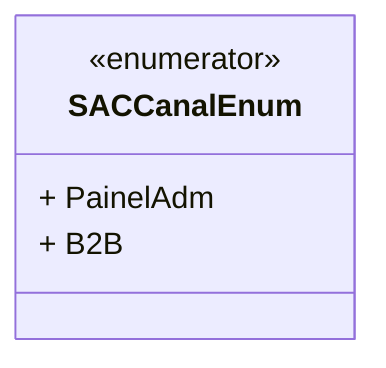

# SACCanalEnum
**Namespace**: IsthmusWinthor.Dominio.Enumeradores  
**Nome do Arquivo**: SACCanalEnum.cs  

## Visão Geral e Responsabilidade
O `SACCanalEnum` é um enumerador que representa os diferentes canais disponíveis para interações no Sistema de Atendimento ao Cliente (SAC). Este modelo enumera os canais através dos quais os usuários podem acessar serviços ou informações, permitindo que a aplicação gerencie e diferencie esses pontos de contato. A utilização deste enum garante que apenas valores válidos e pré-definidos sejam usados na comunicação e registro de dados relacionados auxílios e serviços.

## Tipos Auxiliares e Dependências
- Classes Estáticas/Helpers: Nenhuma
- Enumeradores: 
  - `[SACCanalEnum](SACCanalEnum.md)`

## Diagrama de Relacionamentos

